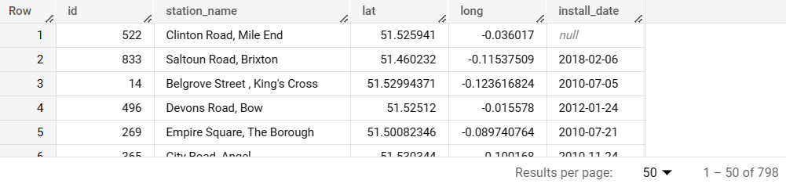

# Data Manipulation in SQL or R? Let’s Do Both!

*Disclaimer: This is the iterated version of my old Linkedin [post](https://www.linkedin.com/pulse/basic-sql-query-using-dplyr-package-r-arif-setyawan/). There are some changes in the writing and use cases in comparison to the old version.*


*Illustration asset by Brooke Lark on [Unsplash](https://unsplash.com/photos/sG-PR0BNwb4?utm_source=unsplash&utm_medium=referral&utm_content=creditShareLink)*

# Introduction to Data Manipulation

Data manipulation is the process of changing or transforming data to make it more useful and meaningful for data analysis. Data manipulation involves performing various operations on data, such as filtering, sorting, joining, and aggregating data. It is one of the essential steps in the data analysis process because it might affect the generated insights. SQL, or Structured Query Language, is the command to acquire data from DBMS (Database Management Systems) or simply call it a data warehouse. To perform data manipulation with SQL, you can use SQL verbs such as `SELECT`, `WHERE`, `ORDER BY`, etc.

***But, do you know that you can also do data manipulation in R?***

In this article, I will share my knowledge about data manipulation in R, its use cases, and also its comparison to the SQL command. The best way to do data manipulation in R, in my humble opinion, is using [Tidyverse](https://www.tidyverse.org/). Tidyverse is a coherent system of packages for data manipulation, exploration, and visualization that share a common design philosophy ([source](https://rviews.rstudio.com/2017/06/08/what-is-the-tidyverse/)). Tidyverse contains multiple packages including the infamous `dplyr` and `ggplot2` packages, you can find the full list of the included packages [here](https://www.tidyverse.org/packages/). Most of the data manipulation functions come from `dplyr` package, but later on, in this article, I will also use `stringr` package which is also included in Tidyverse.

# Data Manipulation in R

## Pipe operator

Before going further, in the Tidyverse work environment, there is an exclusive operator called the pipe operator `%>%` which has a function to chain a sequence of operations or calculations. It simply passes the result of any previous function onto the function afterward. If you are using R Studio, you can instantly write a pipe operator using `CTRL` +`SHIFT` +`M` on your keyboard. Learn more about the pipe operator [here](https://www.datacamp.com/tutorial/pipe-r-tutorial).

## Data for use cases

I used a dataset from Google Big Query called `london_bicycles` dataset, it contains two data tables named `cycle_hire` and `cycle_stations`. For the sake of efficiency, I’d only use the `cycle_stations` table since the other table is significant in size.

Loading required package

```r
library(tidyverse)
```

Importing the data to R

```r
cycle_stations <- read_csv("cycle_stations.csv")
```

## SELECT verb

In SQL, `SELECT` is used to subset a table by its columns. The subsetted table can also have its columns’ names aliased into something else using `AS`. 

```sql
-- SQL
SELECT
  id,
  name AS station_name,
  latitude AS lat,
  longitude AS long,
  install_date
FROM
  `bigquery-public-data.london_bicycles.cycle_stations`
```



To query the whole table, use `SELECT *` instead.

```sql
-- SQL
SELECT
  *
FROM
  `bigquery-public-data.london_bicycles.cycle_stations`
```


In R, to achieve the same result, use the `select()` function. To give aliases to columns’ names, use `=` after selecting columns.

```r
# R
cycle_stations %>% 
  select(
    id, 
    station_name = name, 
    lat = latitude,
    long = longitude,
    install_date
  )
```


When calling a table (or `data.frame`) in R, the outcome is always the whole table. So you do not need to do any extra steps, simply call its variable name and for this case is `cycle_stations`.

```r
# R
cycle_stations
```


## DISTINCT verb

Used for extracting unique values from columns.

```sql
-- SQL
SELECT
  DISTINCT install_date
FROM
  `bigquery-public-data.london_bicycles.cycle_stations`
```


In R, use the `distinct()` function.

```r
# R
cycle_stations %>% 
  distinct(install_date)
```


## WHERE verb

The `WHERE` verb is used to filter a table with condition(s). You can add multiple condition(s) with the `AND` clause.

```sql
-- SQL
SELECT
  id,
  name AS station_name,
  latitude AS lat,
  longitude AS long,
  install_date
FROM
  `bigquery-public-data.london_bicycles.cycle_stations`
WHERE
  id < 100
```


```sql
-- SQL
SELECT
  id,
  name AS station_name,
  latitude AS lat,
  longitude AS long,
  install_date
FROM
  `bigquery-public-data.london_bicycles.cycle_stations`
WHERE
  id < 100
  AND install_date >= "2010-10-01"
```


In R, the equivalent function is `filter()`. To add multiple filter conditions, use a comma `,` after each condition.

```r
# R
cycle_stations %>%
  select(
    id, 
    station_name = name, 
    lat = latitude,
    long = longitude,
    install_date
  ) %>% 
  filter(id < 100)
```


```r
# R
cycle_stations %>%
  select(
    id, 
    station_name = name, 
    lat = latitude,
    long = longitude,
    install_date
  ) %>% 
  filter(
    id < 100,
    install_date >= "2010-10-01"
  )
```


In SQL, there is a greedy text filtering method called `LIKE`. It returns all rows that contain the specific searched text.

```sql
-- SQL
SELECT
  id,
  name AS station_name,
  latitude AS lat,
  longitude AS long,
  install_date
FROM
  `bigquery-public-data.london_bicycles.cycle_stations`
WHERE
  name LIKE '%Avenue%'
```


In R, you can use the `str_detect()` function from `stringr` package that I mentioned earlier.

```r
# R
cycle_stations %>%
  select(
    id, 
    station_name = name, 
    lat = latitude,
    long = longitude,
    install_date
  ) %>% 
  filter(str_detect(station_name, "Avenue"))
```


Notice that in SQL, to apply filter conditions to a column you must use its **original column name**, while in R you must use the **new name** (or its alias).

## ORDER BY verb

Used for sorting a table. Both in SQL and R the command are pretty straightforward. In SQL, use `ORDER BY` clause. The default order is **ascending**, add `DESC` after any column names to change the order to **descending**.

```sql
-- SQL
SELECT
  id,
  name AS station_name,
  latitude AS lat,
  longitude AS long,
  install_date
FROM
  `bigquery-public-data.london_bicycles.cycle_stations`
ORDER BY
  id
```


```sql
-- SQL
SELECT
  id,
  name AS station_name,
  latitude AS lat,
  longitude AS long,
  install_date
FROM
  `bigquery-public-data.london_bicycles.cycle_stations`
ORDER BY
  id DESC
```


In R, use `arrange()` function to get the same result. The default is order is also ascending.

```r
# R
cycle_stations %>%
  select(
    id, 
    station_name = name, 
    lat = latitude,
    long = longitude,
    install_date
  ) %>% 
  arrange(id)
```


To sort in descending order, use `desc()` before the column name.

```r
# R
cycle_stations %>%
  select(
    id, 
    station_name = name, 
    lat = latitude,
    long = longitude,
    install_date
  ) %>% 
  arrange(desc(id))
```


## LIMIT verb

The `LIMIT` command in SQL is used for limiting the result of any queries. To be precise, it limits the result up to the **first N rows** where N is an arbitrary positive integer.

```sql
-- SQL
SELECT
  id,
  name AS station_name,
  latitude AS lat,
  longitude AS long,
  install_date
FROM
  `bigquery-public-data.london_bicycles.cycle_stations`
ORDER BY
  name
LIMIT
  50
```


In R, you can use the `slice_head()` function. In general, `slice()` is the function to slice a table, `slice_head()` is one of the convenient wrapper functions of `slice()`. There are other wrapper functions with different uses, you can learn more about them by running `?slice()` in your R console.

```r
# R
cycle_stations %>%
  select(
    id, 
    station_name = name, 
    lat = latitude,
    long = longitude,
    install_date
  ) %>% 
  arrange(station_name) %>% 
  slice_head(n = 50)
```


## Basic OPERATION

Operation in SQL is the action to create new calculated columns based on existing columns. The operations can be arithmetics, bitwise, comparison, etc. You must provide aliases to those calculated columns, otherwise, it might be hard to read the result.

```sql
-- SQL
SELECT
  id,
  name AS station_name,
  bikes_count,
  docks_count,
  bikes_count/docks_count AS occupancy_rate
FROM
  `bigquery-public-data.london_bicycles.cycle_stations`
WHERE
  docks_count > 0
ORDER BY
  name
```


In R, the `transmute()` function comes in handy.

```r
# R
cycle_stations %>%
  filter(docks_count > 0) %>% 
  transmute(
    id, 
    station_name = name, 
    bikes_count,
    docks_count,
    occupancy_rate = bikes_count/docks_count
  ) %>% 
  arrange(station_name)
```


Working with IF-ELSE operation in SQL.

```sql
-- SQL
SELECT
  id,
  name AS station_name,
IF
  (docks_count > AVG(docks_count) OVER(), 'ABOVE AVERAGE', 'BELOW AVERAGE') AS docks_status
FROM
  `bigquery-public-data.london_bicycles.cycle_stations`
WHERE
  docks_count > 0
ORDER BY
  name
```


In R, use the `if_else()` function.

```r
# R
cycle_stations %>%
  filter(docks_count > 0) %>% 
  transmute(
    id, 
    station_name = name, 
    docks_status = if_else(docks_count > mean(docks_count), "ABOVE AVERAGE", "BELOW AVERAGE")
  ) %>% 
  arrange(station_name)
```


## AGGREGATING values

There are many aggregating commands in SQL, such as `AVG` for averaging values, `COUNT` for counting values, and so on. Here is an example of `AVG` clause without any grouping variables.

```sql
-- SQL
SELECT
  AVG(docks_count) AS average_docks_count
FROM
  `bigquery-public-data.london_bicycles.cycle_stations`
WHERE
  docks_count > 0
```


In R, use `summarize()` function to aggregate values.

```r
# R
cycle_stations %>%
  filter(docks_count > 0) %>% 
  summarize(average_docks_count = mean(docks_count))
```


Here is another example of `AVG` but now using a grouping variable instead.

```sql
-- SQL
SELECT
  CASE
    WHEN name LIKE '%Avenue%' THEN 'Avenue'
    WHEN name LIKE '%Street%' THEN 'Street'
    WHEN name LIKE '%Road%' THEN 'Road'
    WHEN name LIKE '%Lane%' THEN 'Lane'
  ELSE
  'Others'
END
  AS type_of_station,
  AVG(docks_count) AS average_docks_count
FROM
  `bigquery-public-data.london_bicycles.cycle_stations`
WHERE
  docks_count > 0
GROUP BY
  1
ORDER BY
  2 DESC
```


Notice that there is `GROUP BY` verb to tell the system that there is a grouping variable to aggregate the values. Also in the query above, I used a numeric index to refer to which column I wanted to use as a grouping variable and ordering variable. This is an alternative method to specify which column you want to use if there is no original column name available. In this case, the `type_of_station` column does not have its original name since it is a result of an operation.

The equivalent sequence of functions in R for the query above is

```r
# R
cycle_stations %>% 
  filter(docks_count > 0) %>% 
  group_by(
    type_of_station = case_when(
      str_detect(name, "Avenue") ~ "Avenue",
      str_detect(name, "Street") ~ "Street",
      str_detect(name, "Road") ~ "Road",
      str_detect(name, "Lane") ~ "Lane",
      TRUE ~ "Others"
    )
  ) %>% 
  summarize(average_docks_count = mean(docks_count)) %>% 
  arrange(desc(average_docks_count))
```


Here the function used is `group_by()` function along with `case_when()` to imitate the CASE-WHEN operation in SQL.

# Closing Thoughts

By this section, you should have learned about many SQL verbs in R and their use cases. Nonetheless, there are still a plethora of functions of data manipulation which I have not mentioned yet. One of the important techniques in data manipulation when working with multiple datasets from various sources is the joining tables. I will talk about joining tables in another article later on.

> ***So, did you realize that the term data manipulation is not the same as data modification?***
